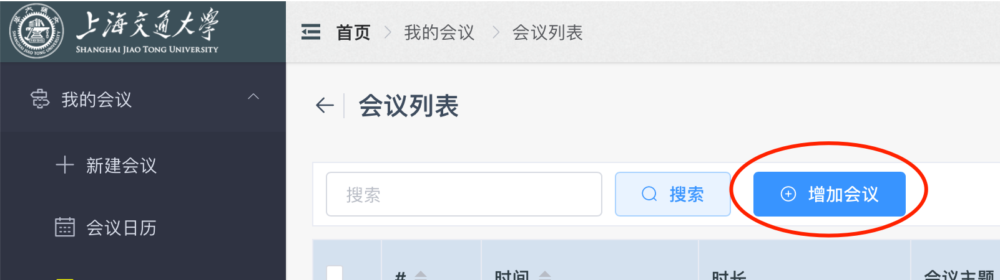
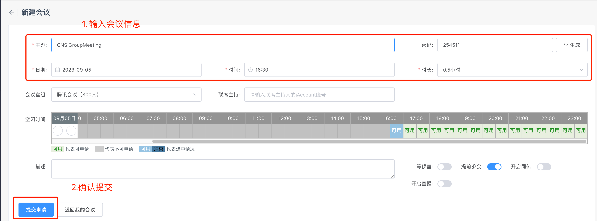
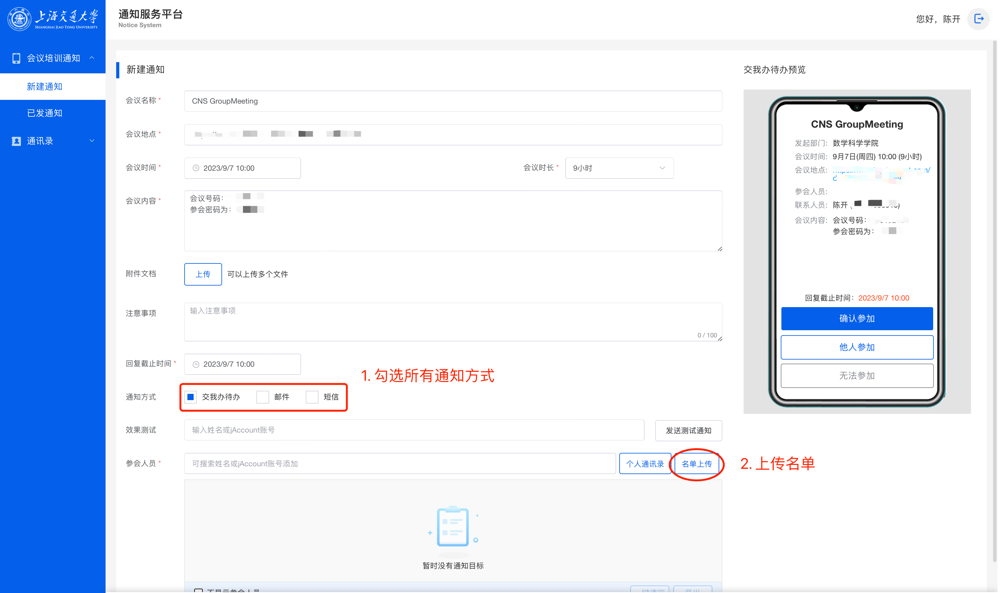

# 预定腾讯会议并发送邀请

1. 打开上海交通大学会议预定系统 meeting.sjtu.edu.cn，点击**添加会议**
    

2. 填写会议信息，点击**提交申请**
    

3. 会议预定成功，点击**发送邀请**，选择**邀请方式**，并上传组会参会者名单EXCEL表格，或从通讯录导入，点击**发送邀请**
    
    

4. 会议邀请已发送至邮箱或交我办代办，点击**腾讯会议链接**即可加入会议
