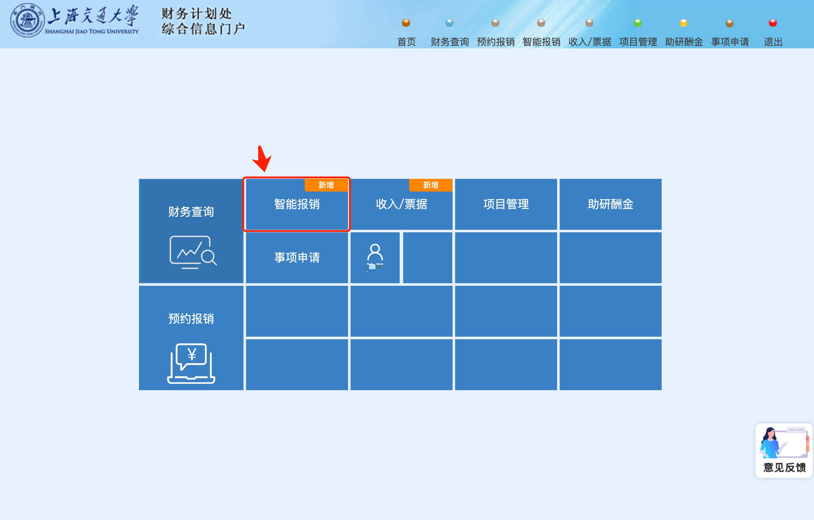
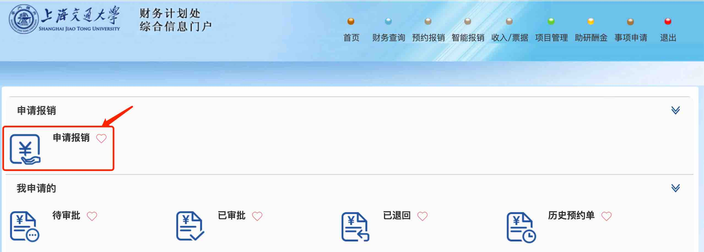
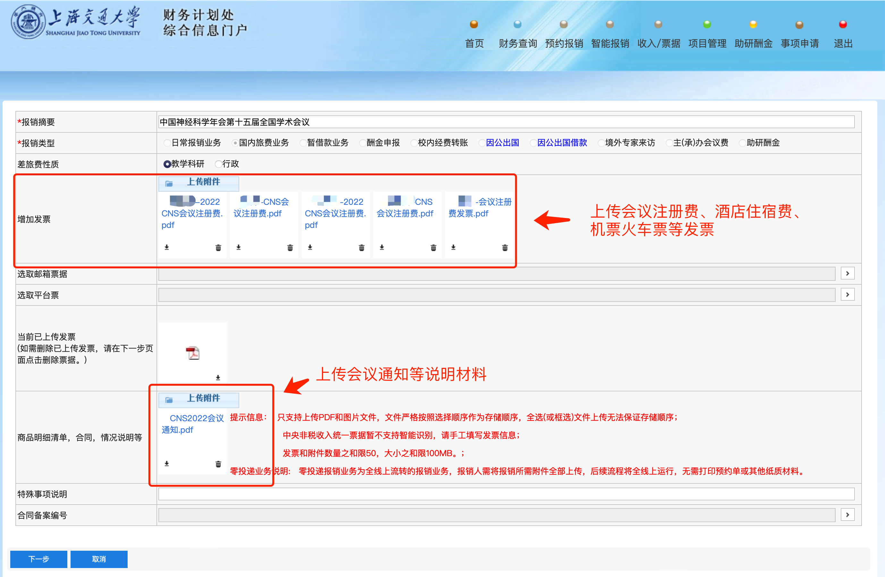
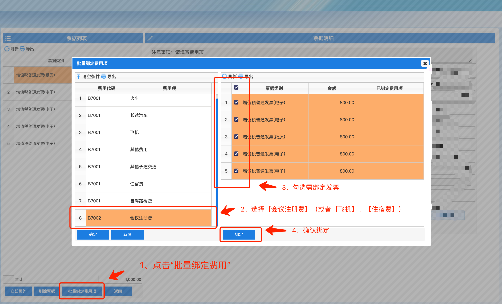
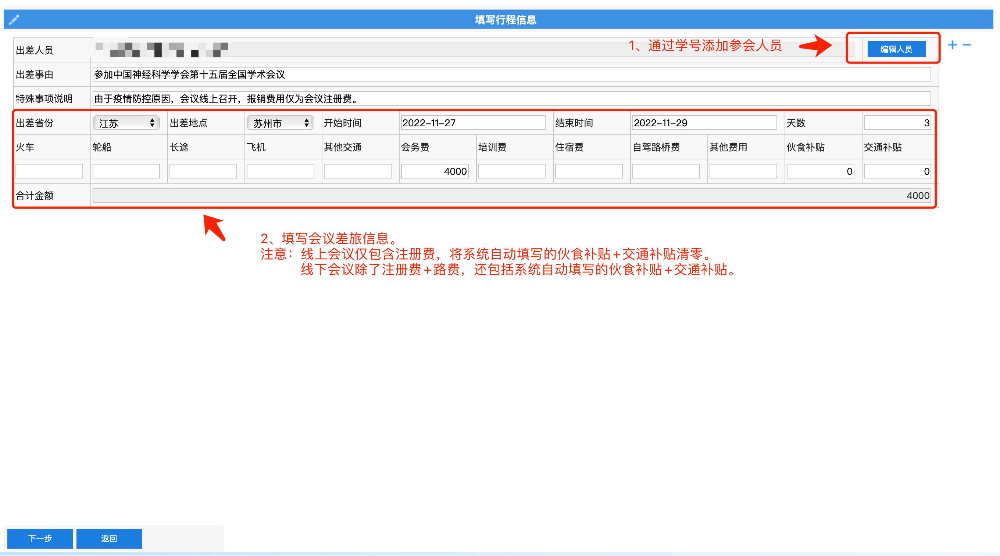
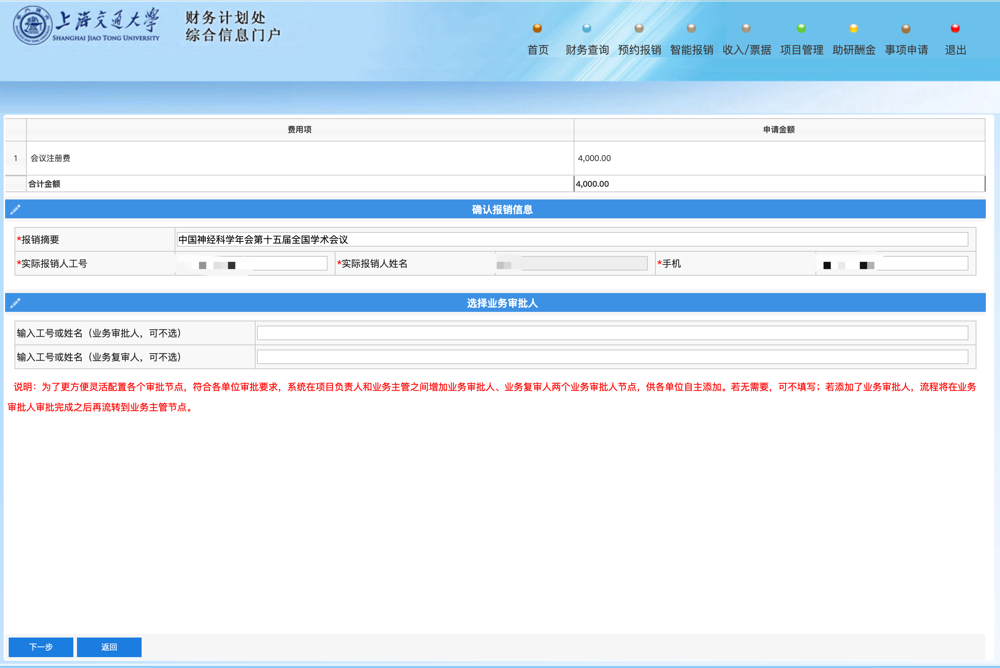

# 会议报销流程

```{note}
1. 提醒参会同学：高铁出行->打印**蓝色纸质车票**，飞机出行->打印航班**行程单**
2. 差旅酒店离店之前，打印流水单，流水单上金额需与发票金额一致。
3. 学生差旅额度：飞机经济舱(尽量提前预定机票)，高铁二等座，酒店：每人每天550元（出差目的地北京上海，每人每天650元）。
```

## 报销流程

1. 通过jaccount登陆[交大财务处](https://cwc.jdcw.sjtu.edu.cn)，选择**智能报销**

    

2. 选择申请报销。申请成功后可以在**待审批**、**已审批**查看审批进度

    

3. 新增报销

    

4. 填写报销摘要，并上传发票PDF或图片附件。选择下一步后，等待系统自动识别发票信息

    

5. 批量绑定（或手动选择）费用项目

    

    绑定完成后，选择立即预约.

6. 填写出差人员信息，完成后选择下一步

    

7. 直接选择下一步

    

8. 选择导师提供的经费号， 并选择匹配的预算项

    

9. 填写报销收款人收款学号。

    

10. 报销材料提交
    - 若系统提示本次报销为**零投递业务**，则无需后续操作，等待财务审核通过后，报销款就会到账。
    - 若系统提示本次业务**非零投递业务**，则需要等待导师和学院审核通过后，打印确认单与**所有发票与其他材料**（包括但不限于会议通知，电子发票打印件，纸质发票原件，酒店流水单等），前往**理科楼五号楼一楼**报销投递机器处扫码投递。
    - 若报销过程中，财务处发现材料缺失或其他问题无法报销，你将在*交我办*app中收到消息提醒。请届时带齐补充材料，前往**行政楼B楼一楼财务计划处**处理。

11. 材料留档

    1. 待审批通过后，在**智能报销-已审批**内找到报销条目，保存预约报销单, 保存为`打印确认单.pdf`。
    2. 整理**所有电子发票+纸质发票扫描件+其他材料**，与报销单一起打包📦，以`yyyy-mm-dd-[报销内容].zip`命名，例如`2021-11-27-CNS会议报销.zip`。
    3. 上传压缩文件至**报销留档**文件夹。
