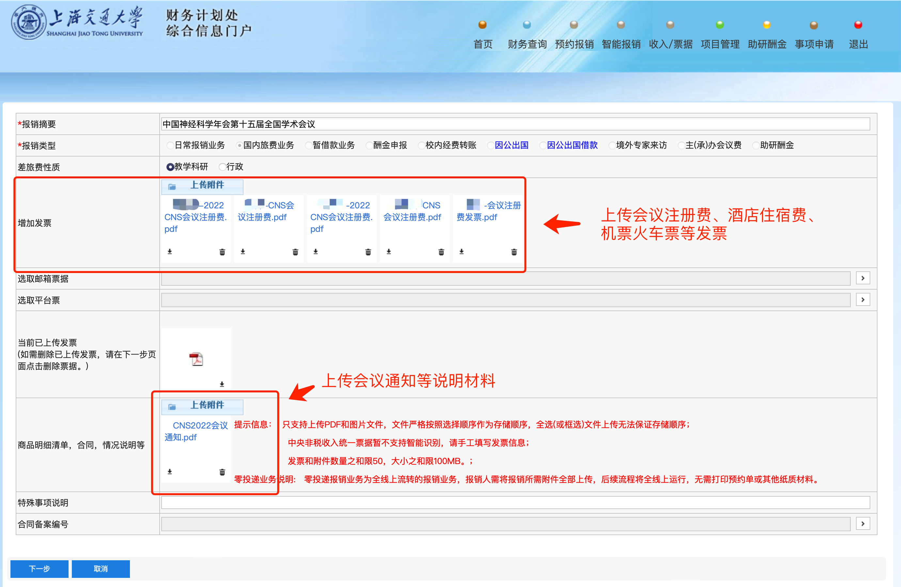
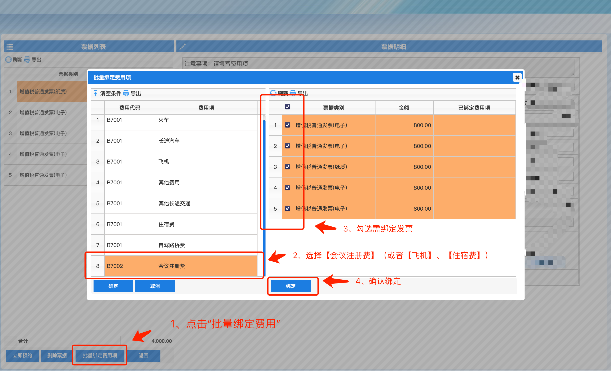
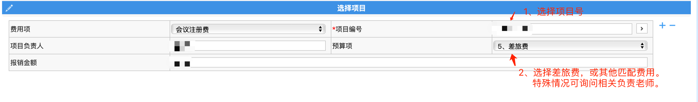

# 会议报销流程

> **注意事项：**
> 
> 1. 提醒参会同学：高铁出行->打印【蓝色纸质车票】，飞机出行->打印航班【行程单】
> 
> 2. 差旅酒店离店之前，打印流水单，流水单上金额需与发票金额一致。
>
> 3. 学生差旅额度：飞机经济舱，高铁二等座，酒店：每人每天550元（出差目的地北京上海，每人每天650元）。

## 1、通过jaccount登陆[交大财务处](cwc.jdcw.sjtu.edu.cn)，选择智能报销

## 2、选择申请报销。申请成功后可以在“待审批”、“已审批”查看审批进度

## 3、新增报销

## 4、填写报销摘要，并上传发票PDF或图片附件。选择下一步后，等待系统自动识别发票信息

## 5、批量绑定（或手动选择）费用项目

绑定完成后，选择立即预约.

## 6、填写出差人员信息，完成后选择下一步

## 7、直接选择下一步

## 8、选择导师提供的经费号， 并选择匹配的预算项

## 9、填写报销收款人收款学号。

## 10、材料留档

1. 保存报销单PDF文件。
2. 整理所有电子发票+纸质发票扫描件+其他材料，与报销单一起打包📦，以yyyy-mm-dd-[报销内容]命名，例如“2022-11-27-CNS会议报销.zip”。
3. 上传压缩文件至“报销留档”文件夹。
