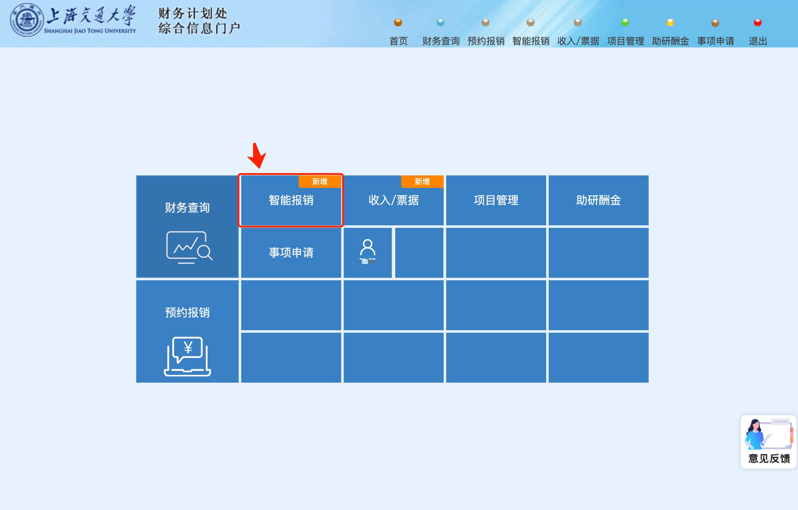
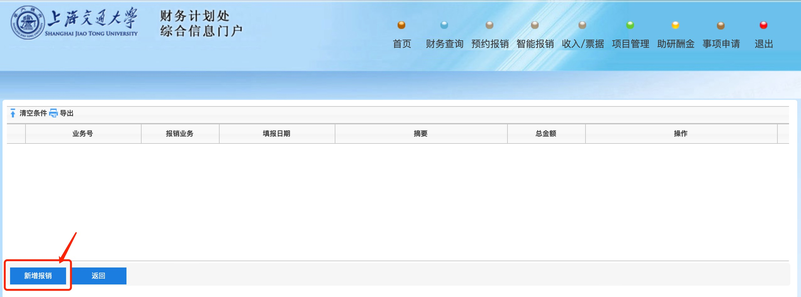
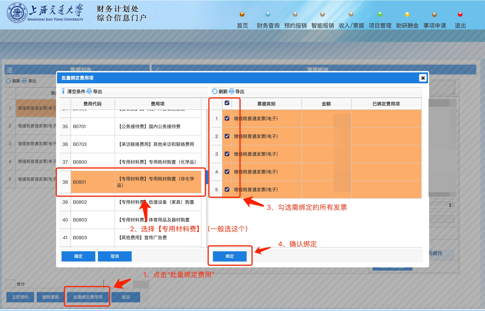
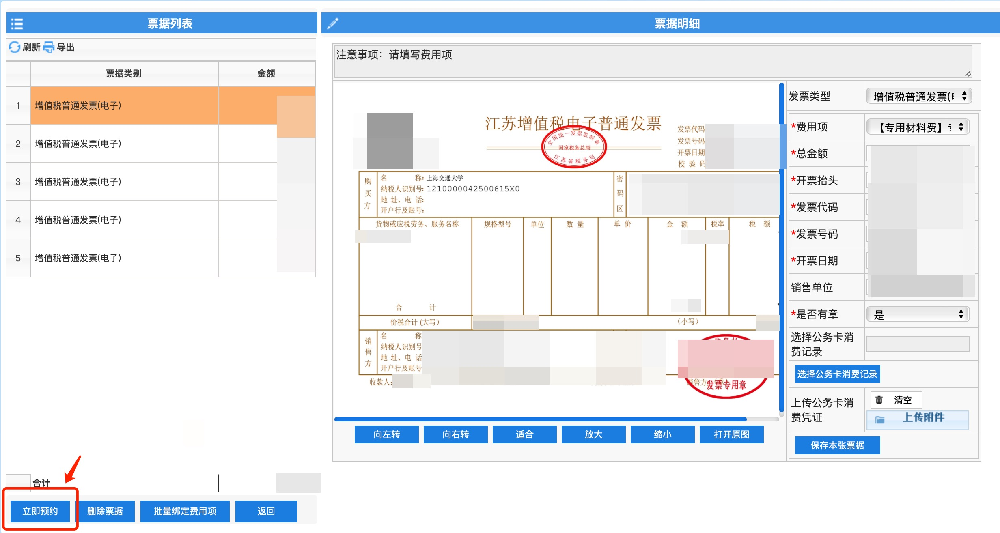
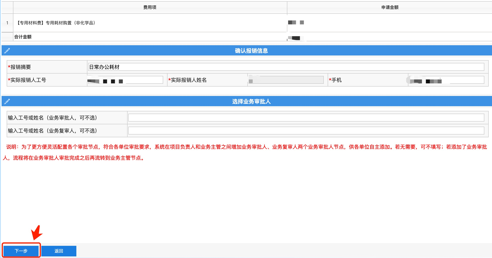
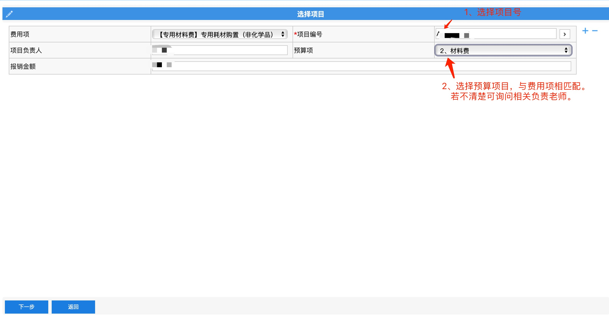
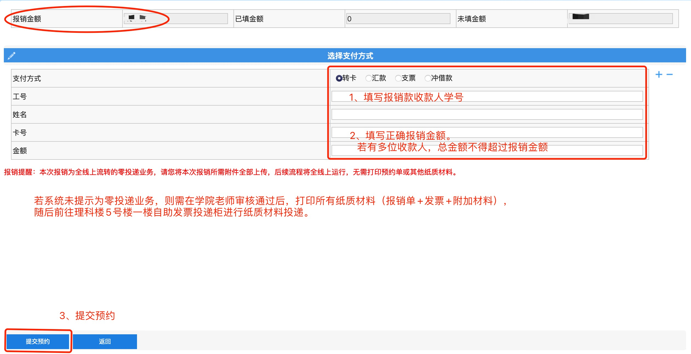

# 办公用品耗材报销流程

> **注意事项：**
> 
> 1. 超过1000元的设备需登记作固定资产，请上报导师申请购买。
> 
> 2. 200～1000元的设备需登记作低值设备，请于申请报销之前，前往理科楼5号楼309办公室领取**低值单**。填写后，作为相关材料，于下述操作第4步中上传。

## 1、通过jaccount登陆[交大财务处](cwc.jdcw.sjtu.edu.cn)，选择智能报销

## 2、选择申请报销。申请成功后可以在“待审批”、“已审批”查看审批进度

## 3、新增报销

## 4、填写报销摘要，并上传发票PDF或图片附件。选择下一步后，等待系统自动识别发票信息

## 5、批量绑定（或手动选择）费用项目

## 6、绑定完成，选择立即预约

## 7、直接选择下一步

## 8、选择导师提供的经费号， 并选择匹配的预算项

## 9、填写报销收款人收款学号。

## 10、材料留档

1. 保存报销单PDF文件。
2. 整理所有电子发票+纸质发票扫描件+其他材料，与报销单一起打包📦，以yyyy-mm-dd-[报销内容]命名，例如“2021-07-08-耗材报销.zip”。
3. 上传压缩文件至“报销留档”文件夹。
